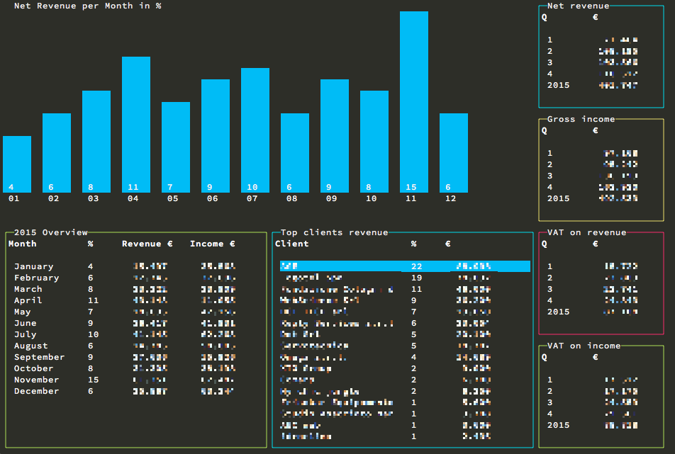

Revenue is a dashboard that gives you a quick summary of your revenue from [Harvest](https://www.getharvest.com/)

# Install

    npm install -g revenue
    
# Help

    Usage: revenue [options]

    Options:

      -h, --help               output usage information
      -V, --version            output the version number
      -y, --year [year]        specify a year different than current year
      -f, --force              force update

# TODO

* [x] cache
* [x] quarters
* [x] graphs
* [ ] locales
* [ ] comparisons
* [ ] estimates
